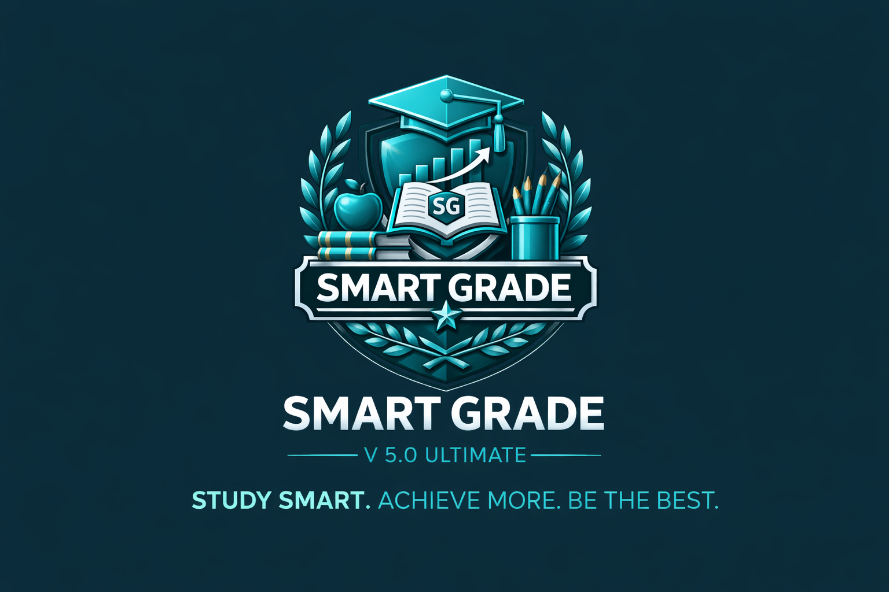
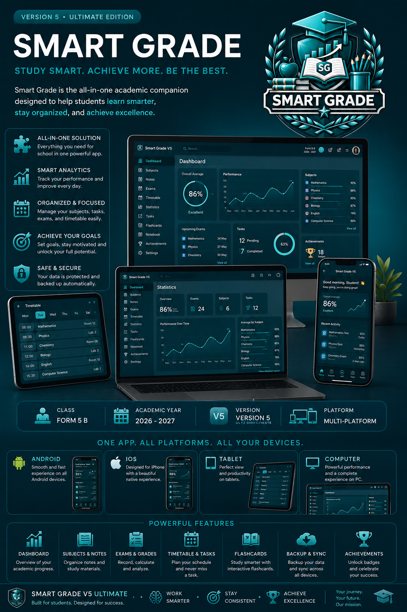

<!-- ============================================ -->
<!-- HEADER SMART GRADE - BANNIÈRE + ANIMATION -->
<!-- ============================================ -->

<!-- Bannière -->
<p align="center">
  
</p>

<!-- Titre animé -->
<p align="center">
  
</p>

<!-- Slogan animé -->
<p align="center">
  
</p>
<p align="center">
  
</p>

<p align="center">
  <strong style="font-size:1.1rem;color:#0f3b48;">SIN GBHS FOUMBAN - Form 5B Science</strong><br>
  <span style="font-size:0.9rem;color:#4a627a;">Academic Year 2026-2027</span>
</p>

<!-- BADGES 2 PAR LIGNE -->
<!-- ============================================ -->
<!-- BADGES SMART GRADE -->
<!-- ============================================ -->

<p align="center">
  <a href="https://hanskepper.github.io/SMART-GRADE-V5.-Ultimate./">
    
  </a>
  <a href="https://hanskepper.github.io/SMART-GRADE-V5.-Ultimate./">
    
  </a>
  <a href="https://github.com/hanskepper/SMART-GRADE-V5.-Ultimate./stargazers">
    
  </a>
<!-- ============================================ -->
<!-- STATISTIQUES SMART GRADE -->
<!-- ============================================ -->

## 📊 SMART GRADE Statistics

<div align="center" style="display: flex; flex-wrap: wrap; justify-content: center; gap: 12px;">

  <!-- 1. Statistiques générales -->
  

  <!-- 2. Langues par repo -->
  
  

  <!-- 3. Heures de productivité (Agrandi à 32% pour s'aligner parfaitement avec les deux premiers) -->
  

  <!-- 4. Graphique d'activité (Prend toute la largeur en dessous) -->
  

</div>
<!-- TABLE OF CONTENTS -->
<!-- ============================================ -->

## Table of Contents

|  | Section |
|---|---------|
| 1 | [Project Overview](#1-project-overview) |
| 2 | [Features](#2-features) |
| 3 | [Technology Stack](#3-technology-stack) |
| 4 | [Architecture](#4-architecture) |
| 5 | [Installation](#5-installation) |
| 6 | [Usage Guide](#6-usage-guide) |
| 7 | [API Reference](#7-api-reference) |
| 8 | [Badges System (23 Badges)](#8-badges-system-23-badges) |
| 9 | [Themes and Fonts](#9-themes--fonts) |
| 10 | [Developer](#10-developer) |
| 11 | [License](#11-license) |
| 12 | [GitHub Repository](#12-github-repository) |

---
<!-- ============================================ -->
<!-- SECTION 1: PROJECT OVERVIEW -->
<!-- ============================================ -->

## 1. Project Overview

> **SMART GRADE** is a complete **Progressive Web Application (PWA)** for grade management, designed specifically for **SIN GBHS FOUMBAN Form 5B Science** students. The application works **100% offline** after first installation and stores all data locally on the user's device.

### School Information

| Field | Value |
|-------|-------|
| **Name** | SIN GBHS FOUMBAN |
| **Class** | Form 5B Science |
| **Academic Year** | 2026-2027 |
| **Location** | Foumban, West Region, Cameroon |

### Key Numbers

- 📚 **14** Subjects
- 📊 **6** Sequences
- 🗓️ **3** Terms
- 🏆 **23** Badges
- 🎨 **20** Themes
- 🔤 **12** Fonts
- 🔍 **15** Search Sources
- 🤖 **3** AI Models
<!-- ============================================ -->
<!-- SECTION 2: FEATURES -->
<!-- ============================================ -->

## 2. Features

### Academic Features

| Feature | Description |
|---------|-------------|
| **14 Subjects** | Customizable coefficients (1-10) |
| **6 Sequences** | 2 per term, 3 terms per year |
| **Smart Rounding** | Automatic compensation system |
| **Advanced Stats** | Predictions and performance analysis |
| **Yearly Report** | Letter grades (A+, A, B+, B, C, D, F) |

### Analytics and Visualization

| Feature | Description |
|---------|-------------|
| **Bar Charts** | Interactive Chart.js graphs |
| **Radar Charts** | Subject comparison |
| **Doughnut Charts** | Grade distribution |
| **Zoomable** | Progress chart with zoom |
| **Trend Analysis** | Performance over time |

### Study Tools

| Feature | Description |
|---------|-------------|
| **Flashcards** | Default + custom cards per subject |
| **Goals System** | Progress bars for targets |
| **Timetable** | Class schedule viewer |
| **23 Badges** | Achievement and streak badges |
| **Streak Tracking** | Daily usage tracking |

### Security

| Feature | Description |
|---------|-------------|
| **Fingerprint** | WebAuthn API biometric login |
| **4-digit PIN** | Secure authentication |
| **Local Storage** | No external servers |

### Export and Transfer

| Feature | Description |
|---------|-------------|
| **JSON** | Complete backup |
| **CSV** | Spreadsheet format |
| **HTML** | Viewable report |
| **PDF** | Professional report card |
| **Import** | JSON backup restore |
| **QR Code** | Data transfer |
| **6-digit Code** | Local transfer |

### AI Assistant

| Feature | Description |
|---------|-------------|
| **Groq** | Ultra Fast |
| **Devstral** | Medium |
| **Codestral** | Code-focused |
| **LaTeX** | Math support |
| **Prism.js** | Code highlighting |
| **Mermaid** | Diagram generation |
| **Conversation History** | Save and view past conversations |

### Multi-Search Engine

| Source | Type |
|--------|------|
| DuckDuckGo | General search |
| Wikipedia | Encyclopedia |
| Wiktionary | Dictionary |
| OpenLibrary | Books |
| WikiMedia | Media |
| Wikidata | Knowledge base |
| Google Books | Books |
| Internet Archive | Archive |
| Jisho | Japanese dictionary |
| TheAudioDB | Music database |
| OMDb | Movies database |
| NewsAPI | News |
| YouTube | Videos |
| Reddit | Discussions |
| GitHub | Code repositories |

### Notebook

| Feature | Description |
|---------|-------------|
| **Personal Notes** | Create and manage notes |
| **Pinning** | Pin important notes to top |
| **Color Coding** | Organize notes by color |
| **Subject Tagging** | Tag notes by subject |
| **Full-Text Search** | Search through all notes |

### Homework Manager

| Feature | Description |
|---------|-------------|
| **Admin Panel** | Teachers can manage assignments |
| **File Attachments** | Images, videos, PDFs |
| **Cloud Sync** | Via GitHub Gist |
| **Student View** | View and track assignments |

### Chat System

| Feature | Description |
|---------|-------------|
| **P2P Chat** | Via JSONBin.io |
| **Real-Time Sync** | Automatic updates |
| **Unique Codes** | Each user has a unique code |

### Developer Tools

| Feature | Description |
|---------|-------------|
| **Grade Calculator** | Advanced calculation tools |
| **Database Manager** | View and manage user data |
| **Advanced Statistics** | Detailed performance analysis |
| **System Logs** | Real activity history |
| **Cloud Backup** | Real backup and restore |
| **System Config** | View and modify settings |

---

<!-- ============================================ -->
<!-- SECTION 3: TECHNOLOGY STACK -->
<!-- ============================================ -->

## 3. Technology Stack

### Frontend

| Technology | Details |
|------------|---------|
| **HTML5** | Semantic Markup, LocalStorage API, Canvas API, MediaDevices API, Notification API |
| **CSS3** | Flexbox, Grid Layout, CSS Variables, Glassmorphism, Media Queries |
| **JavaScript ES6+** | Promises, Async/Await, LocalStorage Database Management |

### Libraries

| Library | Version | Purpose |
|---------|---------|---------|
| Chart.js | v4.4.0 | Interactive charts |
| chartjs-plugin-zoom | - | Zoomable graphs |
| html2pdf.js | v0.10.1 | PDF generation |
| QRCode.js | - | QR code generation |
| html5-qrcode | - | QR code scanning |

### PWA

| Technology | Purpose |
|------------|---------|
| Service Worker | Offline caching |
| Web App Manifest | Installation support |
| WebAuthn API | Biometric authentication |

### Icons and Fonts

| Type | Details |
|------|---------|
| **Icons** | Font Awesome 6.5.1 |
| **Fonts** | 12 Google Font families |

---

<!-- ============================================ -->
<!-- SECTION 4: ARCHITECTURE -->
<!-- ============================================ -->

## 4. Architecture

### File Structure

```
SMART-GRADE-V5.-Ultimate./
├── index.html                 Home page with account list
├── login.html                 PIN + Fingerprint authentication
├── register.html              Account creation
├── dashboard.html             Main dashboard with statistics
├── add-grade.html             Grade entry interface
├── subjects.html              Subject management
├── term1.html                 Term 1 report
├── term2.html                 Term 2 report
├── term3.html                 Term 3 report
├── yearly.html                Yearly summary
├── statistics.html            Charts and analytics
├── achievements.html          Badges and streaks
├── flashcards.html            Study cards
├── goals.html                 Academic goals
├── timetable.html             Class schedule
├── homeworks.html             Homework viewer
├── notebook.html              Personal notebook
├── profile.html               User profile with avatar
├── settings.html              App settings
├── export.html                JSON, CSV, HTML, PDF export
├── backup.html                Backup manager
├── history.html               Activity log
├── notifications.html         Notification center
├── transfer.html              QR code and local transfer
├── search.html                Multi-source search engine
├── ai-assistant.html          AI Assistant with 3 models
├── chat.html                  P2P chat system
├── support.html               Help and support
├── guide.html                 Public user guide
├── guide-user.html            Private user guide
├── about.html                 Public about page
├── about-user.html            Private about page
├── terms.html                 Terms of Use
├── privacy.html               Privacy Policy
├── cookies.html               Cookies Policy
├── license.html               MIT License
├── eula.html                  End User License Agreement
├── doc.html                   Developer documentation
├── README.md                  This file - Complete description
├── splash.html                Loading screen
├── welcome.html               Post-login welcome
├── admin-homework.html        Homework admin panel
├── dev-calculator.html        Grade Calculator
├── dev-database.html          Database Manager
├── dev-stats.html             Advanced Statistics
├── dev-logs.html              System Logs
├── dev-backup.html            Cloud Backup
├── dev-config.html            System Config
├── 400.html                   400 Bad Request
├── 401.html                   401 Unauthorized
├── 403.html                   403 Forbidden
├── 404.html                   404 Not Found
├── 500.html                   500 Internal Server Error
├── 502.html                   502 Bad Gateway
├── 503.html                   503 Service Unavailable
│
├── css/
│   ├── base.css               Reset, variables, animations
│   ├── layout.css             Header, sidebar, modals
│   ├── components.css         Cards, buttons, forms
│   ├── themes.css             20 color themes
│   └── night-mode.css         Dark mode styles
│
├── js/
│   ├── utils.js               Core utilities (toast, dates, calculations)
│   ├── database.js            localStorage CRUD operations
│   ├── auth.js                PIN and WebAuthn authentication
│   ├── app.js                 UI initialization (themes, fonts, menu)
│   ├── transfer.js            QR code and local transfer
│   ├── confirm-dialog.js      Custom confirmation dialogs
│   ├── install-handler.js     PWA installation
│   ├── auto-save.js           Auto-save every 30 seconds
│   ├── auto-update.js         Version checking
│   ├── cloud-sync.js          Cloud backup (JSONBin.io)
│   ├── pwa.js                 PWA configuration
│   ├── storage.js             Storage manager
│   └── auto-updater.js        Auto-update system
│
└── PWA/
    ├── manifest.json          PWA manifest
    ├── sw.js                  Service Worker
    └── icon.svg               App icon
```

---

<!-- ============================================ -->
<!-- SECTION 5: INSTALLATION -->
<!-- ============================================ -->

## 5. Installation

### Android (Chrome)

| Step | Action |
|------|--------|
| 1 | Open SMART GRADE in Chrome browser |
| 2 | Tap the menu button (three dots) at top right |
| 3 | Select **Add to Home Screen** or **Install App** |
| 4 | Tap **Install** to add SMART GRADE to your home screen |

### iOS (Safari)

| Step | Action |
|------|--------|
| 1 | Open SMART GRADE in Safari browser |
| 2 | Tap the **Share** button at bottom |
| 3 | Scroll down and tap **Add to Home Screen** |
| 4 | Tap **Add** to install |

### Desktop (Chrome/Edge)

| Step | Action |
|------|--------|
| 1 | Open SMART GRADE in Chrome or Edge |
| 2 | Click the **install icon** in the address bar |
| 3 | Click **Install** to add to your applications |

---

<!-- ============================================ -->
<!-- SECTION 6: USAGE GUIDE -->
<!-- ============================================ -->

## 6. Usage Guide

### Getting Started

| Step | Action |
|------|--------|
| 1 | Create an account on the **Register** page |
| 2 | Set your **4-digit PIN** (keep it secure) |
| 3 | Select subjects for each term in **Settings** |
| 4 | Start adding grades on the **Add Grade** page |

### Tracking Progress

| Page | Purpose |
|------|---------|
| **Dashboard** | Overall averages and stats |
| **Term pages** | Detailed subject averages |
| **Statistics page** | Interactive charts |
| **Achievements page** | Badge progress |
| **Yearly page** | Complete year summary |

### Customization

| Feature | Description |
|---------|-------------|
| **20 Themes** | Choose from 20 color themes |
| **12 Fonts** | Select from 12 font families |
| **Night Mode** | Auto from 8pm to 6am |
| **Profile Photo** | Add from gallery in Profile page |

### Data Management

| Feature | Description |
|---------|-------------|
| **Auto-Save** | Every 30 seconds |
| **Export** | JSON, CSV, HTML, PDF |
| **Backup** | Create and restore backups |
| **Transfer** | QR codes between devices |

### AI Assistant

| Feature | Description |
|---------|-------------|
| **Homework Help** | Ask questions |
| **Explanations** | Any subject |
| **Problem Solving** | Step-by-step |
| **Code and Diagrams** | Generate automatically |

### Search

| Feature | Description |
|---------|-------------|
| **15 Sources** | Simultaneous search |
| **Definitions** | Articles, images, videos |
| **Books** | Music, movies, and more |

---

<!-- ============================================ -->
<!-- SECTION 7: API REFERENCE -->
<!-- ============================================ -->

## 7. API Reference

### Student Management

```javascript
getAllStudents()                    // Returns array of all registered students
getStudentById(id)                  // Returns student object for given ID
createStudentAccount(name, number, class, pin)  // Creates a new student account
deleteStudent(id)                   // Deletes student and all associated data
```

### Grade Management

```javascript
getStudentGrades(id)                // Returns array of all grades for a student
saveStudentGrades(id, grades)       // Saves grades array to localStorage
calculateStudentTermAverage(id, term)  // Returns term average (0 to 20)
calculateYearlyAverage(id)          // Returns yearly average (0 to 20)
calculateSubjectTermAverage(subjectId, term, grades)  // Returns subject average
getGradeLetter(avg)                 // Returns letter grade (A+, A, B+, B, C, D, F)
getStatusText(avg)                  // Returns text status (Excellent, Very Good, Good, etc.)
```

### Subjects Management

```javascript
getStudentSelectedSubjects(id, term)        // Returns array of selected subject IDs
saveStudentSelectedSubjects(id, term, subjects)  // Saves subject selection for a term
getSubjectCoefficients(id)                  // Returns coefficients object for a student
getSubjectCoefficient(id, subjectId)        // Returns coefficient for a specific subject
```

### Achievements Management

```javascript
getStudentAchievements(id)          // Returns achievements array for a student
unlockBadgeById(studentId, badgeId) // Unlocks a specific badge by ID
checkAndUnlockAllNewBadges(studentId) // Checks and unlocks all available badges
```

### Streak Management

```javascript
getStudentStreak(id)                // Returns streak object with days and lastLogin
updateStreakOnVisit(id)             // Updates streak when user logs in
```

### Profile Management

```javascript
getProfile(studentId)               // Returns profile object with avatarBase64, bio, favorites
saveProfile(studentId, profile)     // Saves profile data to localStorage
```

### Export and Import

```javascript
exportCompleteUserData(studentId)   // Exports all user data as JSON string
importCompleteUserData(studentId, jsonData)  // Imports data from JSON backup
```

### Flashcards Management

```javascript
getFlashcards(studentId)            // Returns flashcards array
saveFlashcards(studentId, cards)    // Saves flashcards to localStorage
```

### Goals Management

```javascript
getGoalsDetail(studentId)           // Returns goals detail object
saveGoalsDetail(studentId, goals)   // Saves goals detail to localStorage
```

### Backup Management

```javascript
getStudentBackups(studentId)        // Returns backup list for a student
createBackup(studentId)             // Creates a new backup
restoreBackup(studentId, backupId)  // Restores a backup
```

### Notes Management

```javascript
getStudentNotes(studentId)          // Returns notes array
saveStudentNotes(studentId, notes)  // Saves notes to localStorage
```

---

<!-- ============================================ -->
<!-- SECTION 8: BADGES SYSTEM -->
<!-- ============================================ -->

## 8. Badges System (23 Badges)

### Streak Badges (Auto-unlock)

| Badge | Days | Icon |
|-------|------|------|
| Beginner Streak | 3 consecutive days | |
| Regular Streak | 7 consecutive days | |
| Dedicated Streak | 15 consecutive days | |
| Legendary Streak | 30 consecutive days | |

### Achievement Badges

|  | Badge | Condition |
|---|-------|-----------|
| 1 | First Grade | Add your very first grade |
| 2 | Perfect Score | Get 20/20 in any subject |
| 3 | High Average | Overall average 12/20 and above |
| 4 | Bookworm | Record 10+ grades |
| 5 | Dedication | Record 30+ grades |
| 6 | Scholar | Unlock 8 achievements |
| 7 | Rising Star | Improve by 1+ point in a term |
| 8 | Unstoppable | All 3 terms have grades entered |
| 9 | Subject Completion | Add grades in all subjects of a term |
| 10 | Active Semester | Complete a full term (all sequences) |
| 11 | Discipline Mastery | Average above 15 in one subject |
| 12 | Study Progress | Record 25+ grades |
| 13 | Full Achievement | Unlock all 13 badges |
| 14 | Excellent Result | Get 20/20 in a subject |
| 15 | Comeback King | Go from below 10/20 to above 14/20 |
| 16 | Theme Collector | Try 10 different themes |
| 17 | Photo Uploader | Add a profile photo |
| 18 | Welcome Aboard | First login after installation |
| 19 | Font Collector | Try 6 different fonts |
| 20 | Timetable Viewer | View timetable 10 times |
| 21 | Flashcard Beginner | Create 5 custom flashcards |
| 22 | Flashcard Master | Create 10 custom flashcards |

---

<!-- ============================================ -->
<!-- SECTION 9: THEMES AND FONTS -->
<!-- ============================================ -->

## 9. Themes and Fonts

### 20 Color Themes

| Theme | Color Code |
|-------|------------|
| default (Deep Teal) | #0f3b48 |
| crimson | #c0392b |
| forest | #1e8449 |
| ocean | #006994 |
| royal | #6c3483 |
| sunset | #d35400 |
| rose | #c44569 |
| turquoise | #00897b |
| amber | #b7950b |
| graphite | #455a64 |
| lavender | #7b1fa2 |
| cherry | #b71c1c |
| midnight | #1a237e |
| mint | #00b894 |
| coral | #e74c3c |
| indigo | #283593 |
| chocolate | #5d4037 |
| electric | #6a1b9a |
| steel | #37474f |
| lime | #558b2f |

### 12 Font Families

|  | Font | Style |
|---|------|-------|
| 1 | Inter | Sans-serif |
| 2 | Roboto | Sans-serif |
| 3 | Cinzel | Serif |
| 4 | Quicksand | Sans-serif |
| 5 | Courier Prime | Monospace |
| 6 | Fredoka | Sans-serif |
| 7 | Pacifico | Cursive |
| 8 | Bangers | Cursive |
| 9 | Lobster | Cursive |
| 10 | Permanent Marker | Cursive |
| 11 | Comfortaa | Sans-serif |
| 12 | Righteous | Sans-serif |

### Night Mode

- Activates automatically between **8pm and 6am**
- Can be manually toggled via **Theme button**

---

<!-- ============================================ -->
<!-- SECTION 10: DEVELOPER -->
<!-- ============================================ -->

## 10. Developer

### Personal Information

| Field | Value |
|-------|-------|
| **Name** | HANS KEPPER |
| **Email** | hanskepper52@gmail.com |
| **WhatsApp** | +237 698 640 885 |
| **GitHub** | hanskepper |
| **Country** | Cameroon |

### Education

| Field | Value |
|-------|-------|
| **School** | SIN GBHS FOUMBAN |
| **Class** | Form 5B Science |
| **Year** | 2026-2027 |
| **Specialization** | Web Developer specialized in Web Applications |

---

<!-- ============================================ -->
<!-- SECTION 11: LICENSE -->
<!-- ============================================ -->

## 11. License

**MIT License**

Copyright (c) 2026-2027 HANS KEPPER

Permission is hereby granted, free of charge, to any person obtaining a copy
of this software and associated documentation files (the "Software"), to deal
in the Software without restriction, including without limitation the rights
to use, copy, modify, merge, publish, distribute, sublicense, and/or sell
copies of the Software, and to permit persons to whom the Software is
furnished to do so, subject to the following conditions:

The above copyright notice and this permission notice shall be included in all
copies or substantial portions of the Software.

THE SOFTWARE IS PROVIDED "AS IS", WITHOUT WARRANTY OF ANY KIND, EXPRESS OR
IMPLIED, INCLUDING BUT NOT LIMITED TO THE WARRANTIES OF MERCHANTABILITY,
FITNESS FOR A PARTICULAR PURPOSE AND NONINFRINGEMENT. IN NO EVENT SHALL THE
AUTHORS OR COPYRIGHT HOLDERS BE LIABLE FOR ANY CLAIM, DAMAGES OR OTHER
LIABILITY, WHETHER IN AN ACTION OF CONTRACT, TORT OR OTHERWISE, ARISING FROM,
OUT OF OR IN CONNECTION WITH THE SOFTWARE OR THE USE OR OTHER DEALINGS IN THE
SOFTWARE.

---

<!-- ============================================ -->
<!-- SECTION 12: GITHUB REPOSITORY -->
<!-- ============================================ -->

## 12. GitHub Repository

### Links

| Type | URL |
|------|-----|
| **Repository** | https://github.com/hanskepper/SMART-GRADE-V5.-Ultimate. |
| **Live Demo** | https://hanskepper.github.io/SMART-GRADE-V5.-Ultimate./ |

### Clone Command

```bash
git clone https://github.com/hanskepper/SMART-GRADE-V5.-Ultimate..git
cd SMART-GRADE-V5.-Ultimate.
open index.html
```

---

<!-- ============================================ -->
<!-- FOOTER -->
<!-- ============================================ -->

<p align="center">
  
  <br>
  
  
</p>

<p align="center">
  <a href="https://github.com/hanskepper/SMART-GRADE-V5.-Ultimate./stargazers">
    
  </a>
  <a href="https://github.com/hanskepper/SMART-GRADE-V5.-Ultimate./issues">
    <br>
  </a>
  <a href="https://github.com/hanskepper/SMART-GRADE-V5.-Ultimate./discussions">
    
  </a>
</p>
